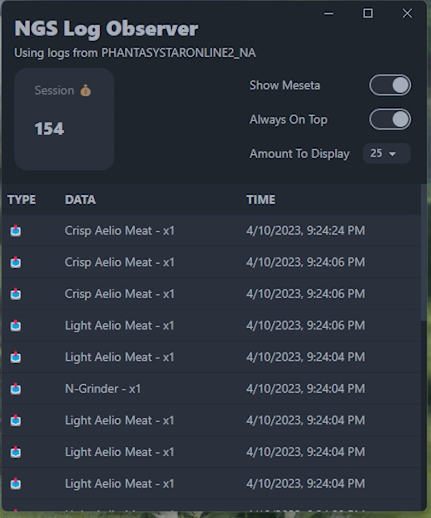

# NGS Log Observer

An _ActionLog_ viewer for [PSO2:NGS©️](https://pso2.com/)

## Repository Information

- [`/app`](app) includes application source code.
- [`/web`](web) includes landing page source code.

## Features

- Watch item drops from a dedicated window as they happen in the game.
- View total N-Meseta gained during your play session.

## [Click here to view releases!](https://github.com/jojobii-arks/ngs-log-observer/releases/)

- Built as a portable `.exe` app. Just download and run!
- Auto-detects the most recently used game directory if you play on multiple versions.
- **NOTE:** The code is unsigned, I'm too stingy for a certificate rn 🤣

## Credit Notes

- Implementation based off of [`@masayoshi4649/PSO2NGSLogViewer`](https://github.com/masayoshi4649/PSO2NGSLogViewer)

---

## Previews (v1.0.4)

 

