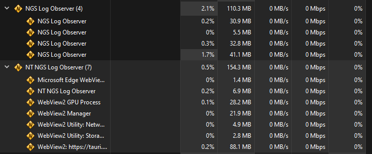

# [NGS Log Observer](https://jojobii-arks.github.io/ngs-log-observer/)

Code repository for NGS Log Observer.

An _ActionLog_ viewer for [PSO2:NGS©️](https://pso2.com/), but in Tauri this time!

## Repository Information

- [`/app`](app) includes application source code.
- [`/web`](web) includes landing page source code.
- View development information in the packages' `README.md` files.

## Differences from [`ot-ngs-log-observer`](https://github.com/jojobii-arks/ot-ngs-log-observer)

- Built with [Tauri](https://tauri.studio/) instead of Electron.
- Less CPU usage for a bit more RAM usage (I think?).

- Starts up **hella** quick.
- `~3MB` installer size compared to `~60MB` for Electron portable binary.

## Credit Notes

- Implementation based off of [`@masayoshi4649/PSO2NGSLogViewer`](https://github.com/masayoshi4649/PSO2NGSLogViewer).
- Icons from [Tabler Icons](https://tabler.io/icons).
- Themes powered by [Misskey's Theme Syntax](https://misskey-hub.net/en/docs/features/theme.html).

---

##### _This application is not affiliated with SEGA or any of its subsidiaries._